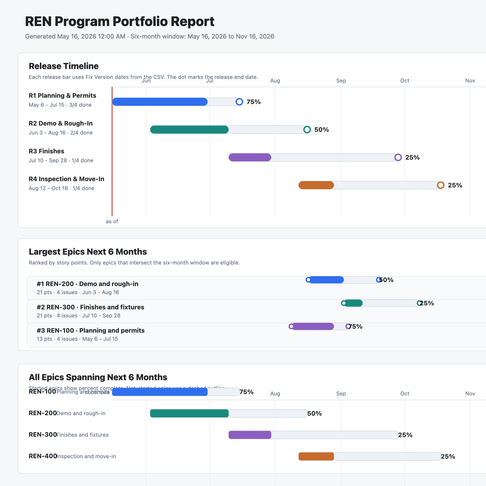
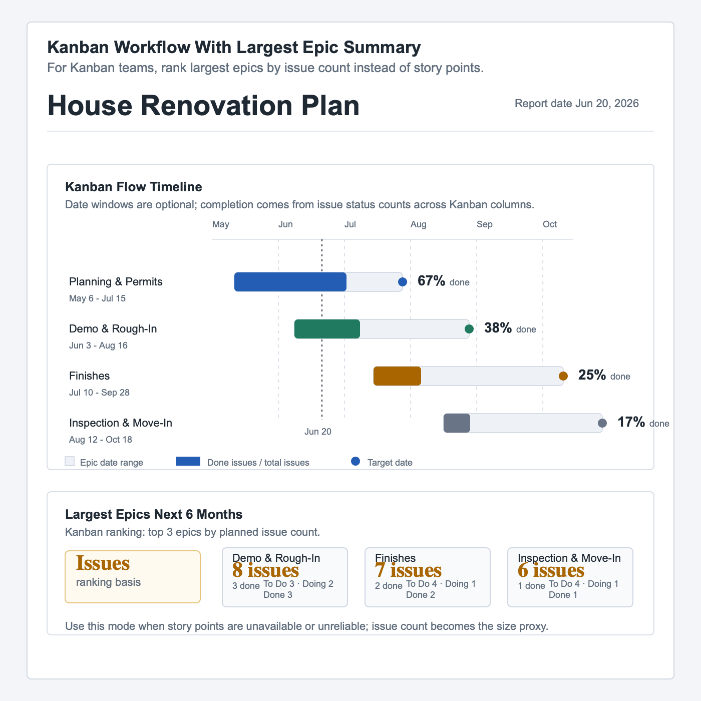
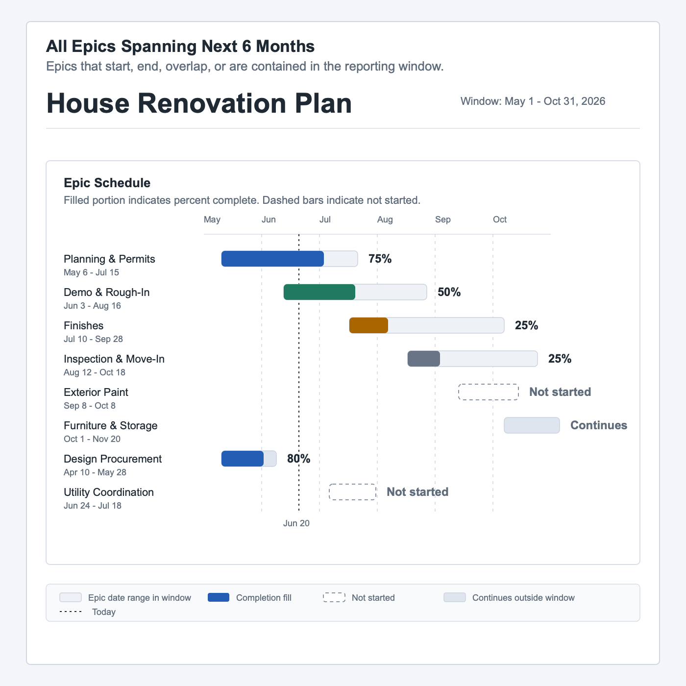

# JiraViz

JiraViz renders an SVG program portfolio report from a Jira CSV export.

## Local Build

```bash
go build -o jiraviz .
./jiraviz -version
```

## Render a Report

```bash
go run . -input mockups/house-renovation-jira.csv -list-projects
go run . -input mockups/house-renovation-jira.csv -project REN -out mockups/generated-house-renovation.svg
```

## Example Visuals

### Program Portfolio Report



### Kanban Top Epics



### All Epics Six-Month Gantt



## Security Scanning and Release Artifacts

The GitHub Actions release workflow builds the CLI and uses Trivy to scan both the repository and the compiled binary. It uploads SARIF to GitHub code scanning, uploads scan outputs as workflow artifacts, and attaches the same files to GitHub Releases when a release is published.

Artifacts are written under `dist/`:

```text
dist/jiraviz
dist/jiraviz-security-artifacts-<version>.tar.gz
```

The security tarball contains `SHA256SUMS` plus the Trivy table, JSON, SARIF, CycloneDX SBOM, binary scan reports, and scan manifest.

The workflow fails on `CRITICAL,HIGH` Trivy findings after writing the security artifacts.
